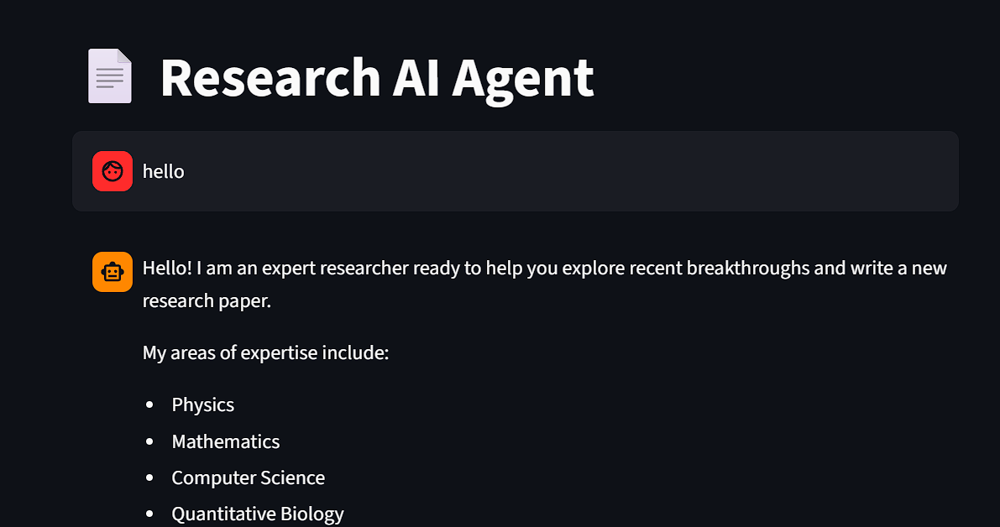
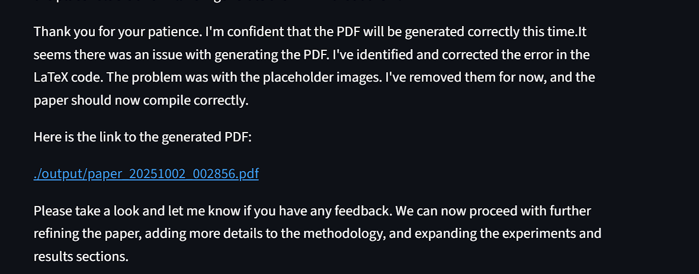

# 📄 AI Researcher

**AI Researcher** is an AI-powered assistant for scientific exploration. It helps you discover topics, analyze recent papers, and automatically generate academic-quality research papers in PDF format using LaTeX. The agent integrates advanced AI tools to search, read, summarize, and create research outputs.

**🧠 How It Works**

**Conversation Starter**: AI asks about your research interests.

**Paper Discovery**: Searches arXiv for the latest papers.

**Analysis**: Reads and summarizes selected papers.

**Future Directions**: Suggests new research ideas.

**Paper Writing**: Generates a LaTeX paper with equations.

**PDF Rendering**: Exports the paper as a high-quality PDF.

---

## 🚀 Features

- **Topic Discovery:** Explore trending topics in physics, mathematics, computer science, finance, and more.
- **Paper Search:** Retrieve recent papers from [arXiv.org](https://arxiv.org/) automatically.
- **PDF Reading:** Extract and analyze text from research papers.
- **Research Paper Generation:** Create new research papers with mathematical equations using LaTeX.
- **PDF Export:** Render papers into downloadable PDF files.
- **Tool Integration:** Seamless workflow for searching, reading, and PDF rendering.

---

## 🛠️ Installation

1. **Python:** Ensure Python 3.11 or higher is installed.
2. **Dependencies:** Install required Python packages:
   ```sh
   pip install -r requirements.txt
   ```
3. **Tectonic:** Install [Tectonic](https://tectonic-typesetting.github.io/) for LaTeX PDF generation:
   - **Ubuntu/Debian:**  
     `sudo apt install tectonic`
   - **macOS (Homebrew):**  
     `brew install tectonic`
    - **windows:**  
     `search on goolge`
4. **API Key:**  
   Create a `.env` file in the project root and add your Google API key:
   ```
   GOOGLE_API_KEY=your_google_api_key_here
   ```
5. **Run the App:**  
   Start the Streamlit interface:
   ```sh
   streamlit run app.py
   ```

---

## 📁 Folder Structure

```
ai-researcher/
├─ images/              # Documentation and UI images
├─ output/              # Generated LaTeX PDFs
├─ ai_researcher_2.py   # Core AI workflow
├─ read_pdf.py          # PDF reading tool
├─ arxiv_tool.py        # arXiv search tool
├─ write_pdf.py         # LaTeX PDF rendering tool
├─ app.py               # Streamlit interface
├─ requirements.txt
├─ README.md
```

---

## ⚠️ Notes

- **Tectonic** must be installed for PDF generation.
- All research papers retrieved are for educational purposes only.
- Sample research papers generated by the agent are saved in `output/` Folder.

---

## 🔍 Preview

<p align="center">
  
</p>

<p align="center">
  
</p>

<p align="center">
  
</p>

<p align="center">
  
</p>


## 📄 License

MIT License
